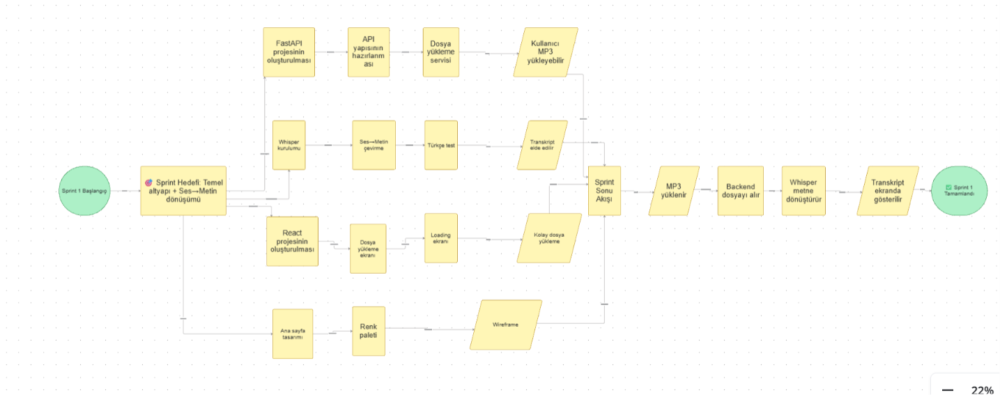
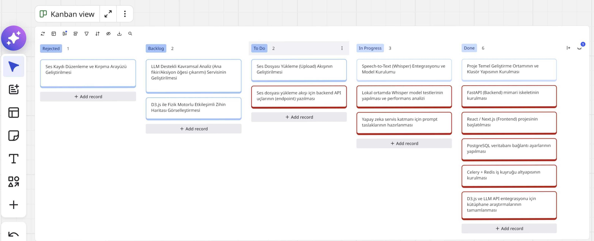
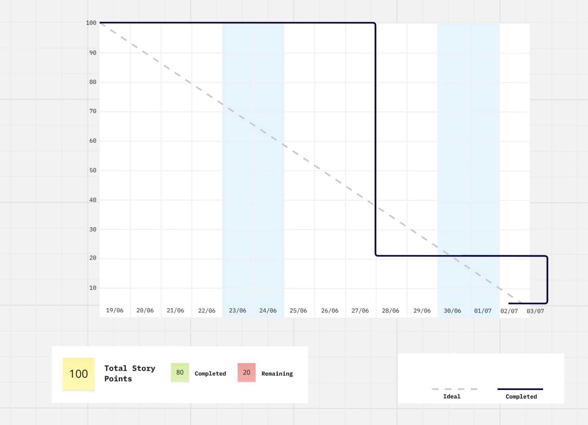
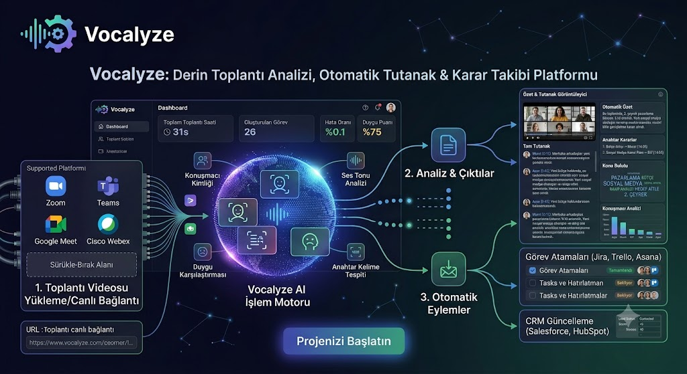
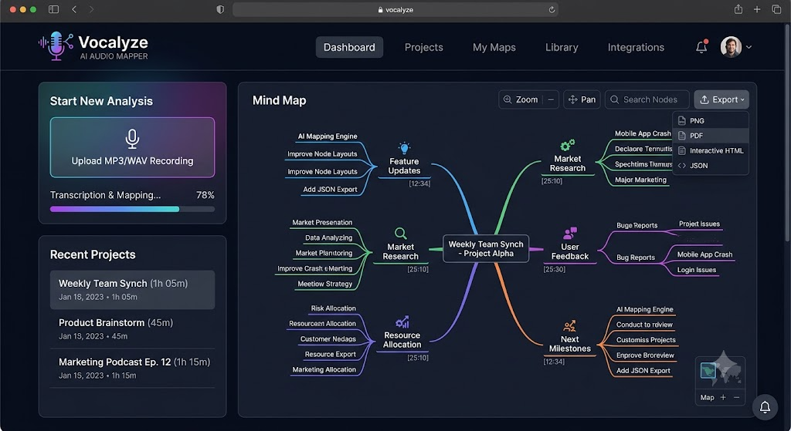
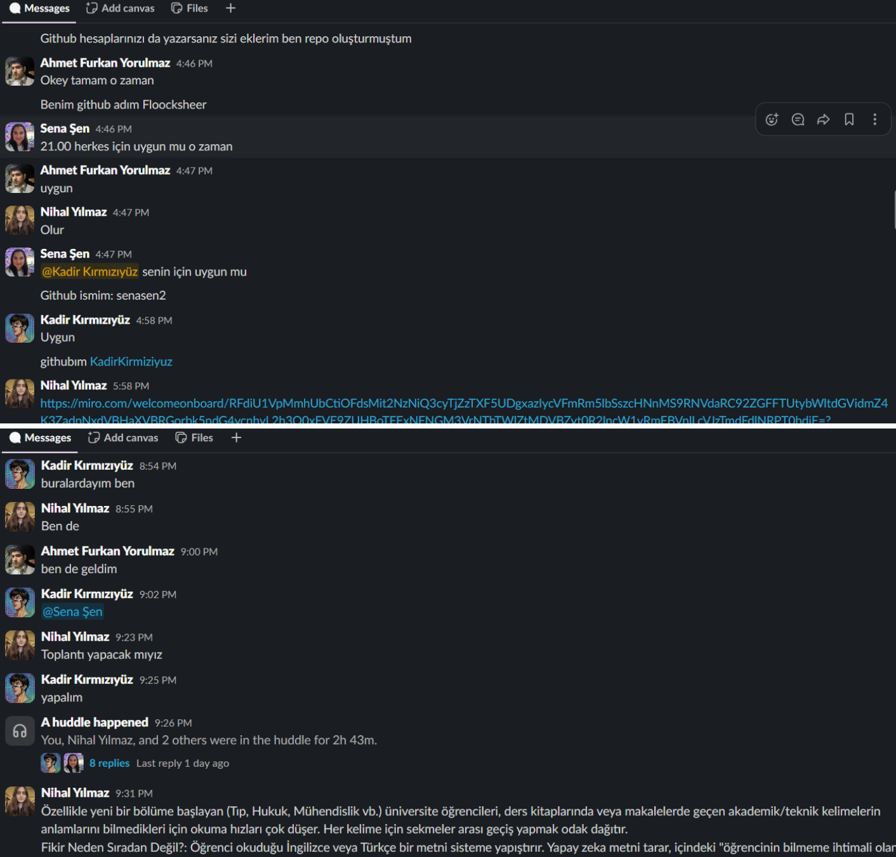
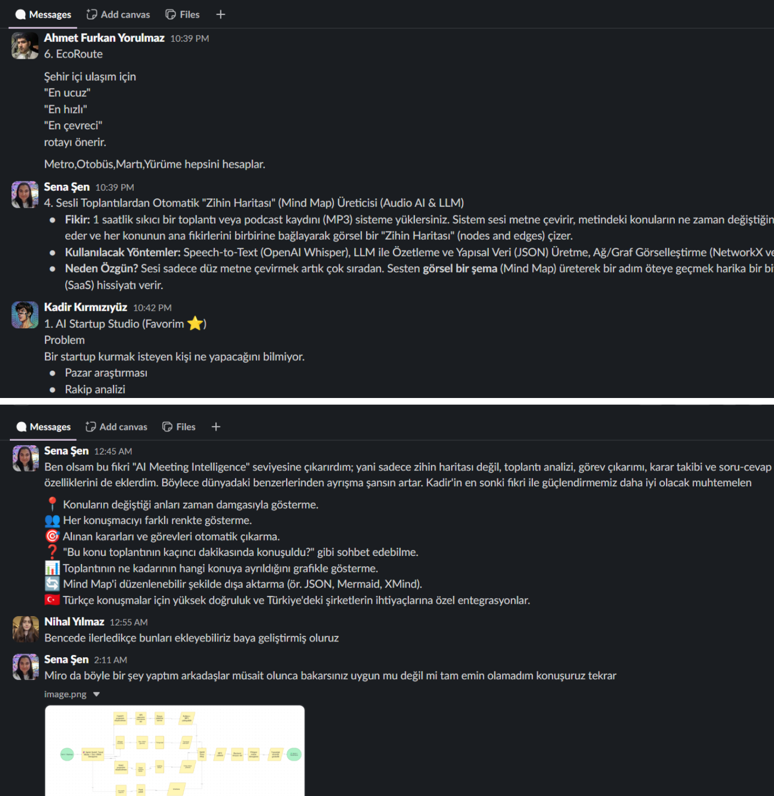
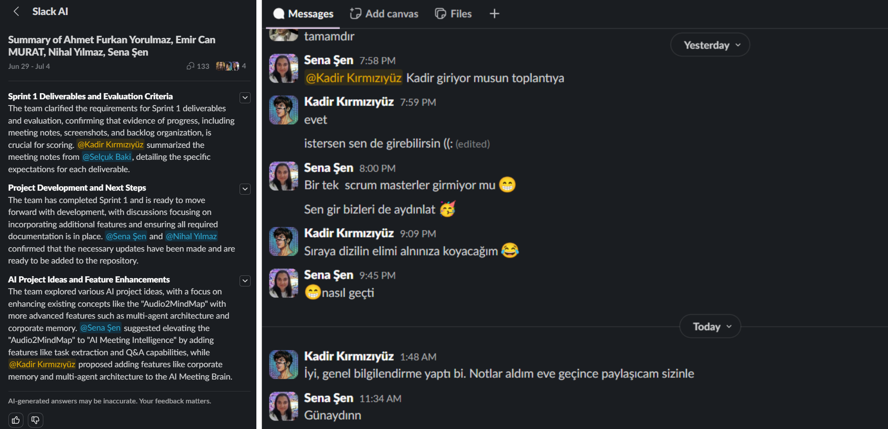

# **Takım İsmi**

[Takım 29]

# Ürün İle İlgili Bilgiler

## Takım Elemanları

- **Ahmet Furkan Yorulmaz**: Product Owner
- **Nihal Yılmaz**: Scrum Master
- **Kadir Kırmızıyüz**: Developer
- **Sena Şen**: Developer

## Ürün İsmi

--Vocalyze--

## Ürün Açıklaması

Audio2MindMap, kurumların ve bireylerin sesli iletişimlerinden maksimum değeri elde etmesini sağlayan, üretken yapay zeka destekli bir analitik ve görselleştirme platformudur. Uzun ve yorucu toplantı ses kayıtlarını, saniyeler içinde etkileşimli, okunabilir ve aksiyona dönüştürülebilir görsel zihin haritalarına çevirir.

Ürün; metin yorgunluğu (uzun, düz PDF dökümlerin okunmaması), toplantı amnezisi (kararların ve görev sahiplerinin unutulması) ve bağlam kopukluğu (fikirler arası ilişkilerin düz metinde görünmemesi) gibi modern iş ve eğitim hayatının temel sorunlarına çözüm sunar.

## Ürün Özellikleri

- Ses kaydını otomatik olarak metne dönüştürme (Speech-to-Text)
- LLM ile ana fikirleri ve alt konuları analiz ederek kavramsal harita çıkarma
- Fizik motorlu (gravity-based), etkileşimli network/zihin haritası görselleştirmesi
- Aksiyon Öğeleri (Action Items) düğümü: LLM'in tespit ettiği görevleri ayrı ve renkli bir düğümde toplama
- Zaman Damgası (Timestamp) entegrasyonu: bir düğüme tıklandığında toplantının ilgili anına referans verme
- Dışa Aktarma: haritanın PNG veya Miro/Notion/draw.io uyumlu JSON formatında indirilmesi
- Düğüme tıklandığında açılan detay panelinde kısa özet ve konuşulduğu zaman aralığının gösterilmesi

## Hedef Kitle

- Çevik (Agile) yazılım ekipleri — sprint planlama ve retrospektif toplantı analizleri için
- Ürün yöneticileri ve satış ekipleri — müşteri görüşmelerini (user discovery, sales calls) haritalandırmak için
- Araştırmacılar, gazeteciler ve öğrenciler — uzun röportaj/ders kayıtlarını çalışılabilir kavram haritalarına dönüştürmek için

## Product Backlog URL

[Miro Backlog Board](https://miro.com/welcomeonboard/RFdiU1VpMmhUbCtiOFdsMit2NzNiQ3cyTjZzTXF5UDgxazIycVFmRm5lbSszcHNnMS9RNVdaRC92ZGFFTUtybWltdGVidmZ4K3ZadnNxdVBHaXVBRGorbk5ndG4ycnhyL2h3Q0xFVE9ZUHJ3YzE1TkREZC9ETlNKR1ZpcVR0L3hNakdSWkpBejJWRjJhRnhhb1UwcS9BPT0hdjE=?share_link_id=861176753230)

---

# Sprint 1

- **Backlog düzeni ve Story seçimleri**: Backlog'umuz öncelik sırasına göre düzenlenmiştir; ilk sprint için proje altyapısının kurulması, ses kaydı yükleme akışı ve Speech-to-Text entegrasyonu gibi temel story'ler seçilmiştir. Sprint başına tahmin edilen puan sayısını aşmayacak şekilde, toplam puanın yarısını geçmeyen tahminlerle story seçimi yapılmıştır. Seçilen story'ler yapılacak işlere (task'lere) bölünerek Miro board üzerinde takip edilmektedir; kırmızı item'lar task'leri, mavi item'lar ise story'leri temsil etmektedir.

- **Daily Scrum**: Daily Scrum toplantılarının ekip üyelerinin farklı programlara sahip olması nedeniyle zamansal sebeplerden ötürü Slack üzerinden yazılı olarak yapılmasına karar verilmiştir. Her ekip üyesi gün içinde yaptığı işi, bir sonraki gün yapmayı planladığı işi ve varsa karşılaştığı engelleri paylaşmaktadır. [Daily Scrum yazışma örnekleri/notları buraya eklenecek]

- **Sprint board update**:

  

  

  

- **Ürün Durumu**:

  

  

- **Sprint Review**: Proje henüz en başlangıç aşamasında olduğu için bu sprintte odak, ürünün üzerine inşa edileceği teknik altyapı kararlarının netleştirilmesi olmuştur. Ekip bir araya gelerek aşağıdaki teknoloji kararlarını almıştır:
  - Ses kaydını metne dönüştürme (Speech-to-Text) için **Whisper** kullanılmasına karar verilmiştir.
  - Backend tarafında, Whisper ile doğal uyumu ve API geliştirme hızı sebebiyle **Python / FastAPI** kullanılmasına karar verilmiştir.
  - Frontend tarafında **React.js (Next.js)** ile geliştirme yapılmasına karar verilmiştir.
  - LLM destekli kavramsal analiz (ana fikir/alt konu/aksiyon öğesi çıkarımı) için bir **LLM API** (OpenAI / Anthropic) entegre edilmesine karar verilmiştir.
  - Fizik motorlu (gravity-based) etkileşimli zihin haritası görselleştirmesi için **D3.js force-directed layout / react-force-graph** kütüphanesinin kullanılmasına karar verilmiştir.
  - Ses dosyalarının asenkron işlenmesi (yükleme → transkript → analiz akışı) için **Celery + Redis** tabanlı bir iş kuyruğu; verilerin saklanması için **PostgreSQL** kullanılmasına karar verilmiştir.

  Bu kararlar doğrultusunda web sitesinin temel altyapısı atılmaya başlanmıştır: proje repo yapısı, backend ve frontend iskeletleri oluşturulmuş, seçilen teknolojilerin proje ortamına kurulumu tamamlanmıştır. Henüz uçtan uca çalışan bir akış bulunmamaktadır; bir sonraki sprintte ses yükleme ve Whisper entegrasyonunun hayata geçirilmesi hedeflenmektedir. Sprint Review katılımcıları: Ahmet Furkan Yorulmaz, Nihal Yılmaz, Kadir Kırmızıyüz, Sena Şen

- **Sprint Retrospective:**
  - Projenin başlangıç aşamasında olması sebebiyle bu sprintin büyük kısmının teknoloji araştırması ve karar alma sürecine ayrıldığı, bunun bir sonraki sprintte geliştirmeye ayrılacak süreyi azaltmaması için erken davranılması gerektiği konusunda fikir birliğine varılmıştır
  - Görev dağılımının sprint başında daha net yapılması gerektiği konusunda fikir birliğine varılmıştır
  - Seçilen teknoloji stack'inin (Whisper, FastAPI, React/Next.js, D3.js force-directed graph, LLM API, Celery/Redis, PostgreSQL) ekip üyelerince benimsendiği, bir sonraki sprintte bu altyapı üzerine ilk çalışan prototipin (ses yükleme + Whisper transkripti) hedeflenmesi gerektiği kararlaştırılmıştır
  - Tahmin puanlarının gerçekçi olup olmadığı, sprint planlama toplantılarında developer'lardan alınan geri bildirimlerle birlikte daha detaylı gözden geçirilmelidir

---

- **Takım İçi İletişim ve Süreç Takibi**:

# Sprint 2

Sprint 2 Hedefi
Kullanıcıların ses dosyalarını platforma yükleyebildiği, arka planda asenkron iş kuyruğu (Celery/Redis) aracılığıyla Whisper kullanılarak metne dönüştürüldüğü uçtan uca (end-to-end) akışı tamamlamak.

User Story 1: Ses Dosyası Yükleme Akışı
Story: Bir kullanıcı olarak, toplantı ses kaydımı sisteme yükleyebilmek istiyorum ki sistem bu kaydı analiz edebilsin.

Kabul Kriterleri (Acceptance Criteria):

Kullanıcı; .mp3, .wav veya .m4a formatındaki dosyaları yükleyebilmelidir.

Yüklenen dosya boyutu için bir sınır belirlenmelidir (Örn: Maksimum 50 MB).

Desteklenmeyen dosya formatlarında veya boyut aşımında kullanıcıya anlaşılır bir hata mesajı gösterilmelidir.

Yükleme sırasında ekranda "Yükleniyor..." (Loading/Progress) animasyonu bulunmalıdır.

Teknik Görevler (Tasks):

Frontend (Next.js): Sürükle-bırak (drag & drop) veya dosya seçici buton barındıran yükleme arayüzünün tasarlanması ve geliştirilmesi.

Frontend (Next.js): Dosya seçimi sonrası format ve boyut validasyonlarının (validation) client-side tarafında yapılması.

Backend (FastAPI): /api/upload endpoint'inin oluşturulması.

Backend (FastAPI): Gelen dosyanın backend tarafında (server-side) doğrulanması ve sunucunun geçici belleğine/klasörüne kaydedilmesi.

User Story 2: Asenkron Transkripsiyon Altyapısı (Celery & Whisper)
Story: Bir sistem olarak, büyük boyutlu ses dosyalarını arka planda asenkron olarak işlemek istiyorum ki kullanıcının tarayıcısı işlem bitene kadar donmasın veya zaman aşımına (timeout) uğramasın.

Kabul Kriterleri (Acceptance Criteria):

Ses dosyası yüklendikten sonra, transkripsiyon işlemi bir iş kuyruğuna (message broker) aktarılmalıdır.

Whisper modeli, kuyruktaki işi alıp metne dönüştürme işlemini başarılı bir şekilde tamamlamalıdır.

İşlemin durumu "Bekliyor (Pending)", "İşleniyor (Processing)" ve "Tamamlandı (Completed) / Hatalı (Failed)" olarak takip edilebilmelidir.

Teknik Görevler (Tasks):

Backend: Celery worker konfigürasyonunun yapılması ve Redis bağlantısının kurulması.

Backend: OpenAI Whisper modelinin (veya API'sinin) projeye entegre edilmesi.

Backend: Celery üzerinde çalışacak transcribe_audio_task isimli asenkron fonksiyonun yazılması.

Veritabanı (PostgreSQL): Yüklenen dosyanın metadata (isim, yüklenme tarihi, durum) bilgilerinin ve işlem bittiğinde ortaya çıkan metnin veritabanına kaydedilmesi.

User Story 3: Transkript Sonucunun Görüntülenmesi
Story: Bir kullanıcı olarak, yüklediğim ses dosyasının metne dönüştürülmüş halini ekranda görmek istiyorum ki toplantıda neler konuşulduğunu okuyabileyim.

Kabul Kriterleri (Acceptance Criteria):

Dosya "İşleniyor" durumundayken ekranda sürecin devam ettiğini belirten bir UI olmalıdır.

İşlem bittiğinde, sayfayı yenilemeye gerek kalmadan Whisper'dan dönen saf metin ekranda gösterilmelidir.

Teknik Görevler (Tasks):

Backend (FastAPI): Frontend'in işlemin durumunu sorgulayabileceği /api/task/{task_id}/status endpoint'inin geliştirilmesi.

Frontend (Next.js): Polling mekanizması kurularak (örneğin her 3 saniyede bir) ilgili task'in durumunun sorgulanması. (Not: İleride WebSockets'e geçirilebilir, ancak Sprint 2 için polling daha hızlı bir çözümdür).

Frontend (Next.js): Gelen metnin arayüzde okunabilir bir şekilde render edilmesi.

Sprint 2 
Kodlama Görselleri

-------------------------------------------------------------------------------------------------------------------------------------------------------------------------

Takım Konuşmaları

# Sprint 3

Değerli Ekip Arkadaşlarım ve Proje Paydaşları,

Takım 29 olarak geliştirmekte olduğumuz Vocalyze (AI Audio Mapper) projemizin 3. Sprint'ini büyük bir başarıyla tamamlamış bulunuyoruz. Bu sprint boyunca temel amacımız, sistemin kalbini oluşturan yapay zeka entegrasyonlarını tamamlamak, kullanıcı arayüzünü (UI) etkileşimli hale getirmek ve backend ile frontend arasındaki veri akışını kusursuzlaştırmaktı.

İşte bu sprintte hayata geçirdiğimiz kritik özellikler ve teknik başarılarımız:

✨ Öne Çıkan Yeni Özellikler
Etkileşimli Zihin Haritası (Interactive Mind Map): Kullanıcıların yüklediği ses kayıtlarını analiz ederek React Flow altyapısı ile dinamik, sürüklenebilir ve dışa aktarılabilir (PNG/JSON) zihin haritaları oluşturmayı başardık.

Çoklu Dil Desteği (Multi-Language Output): Gemini AI entegrasyonumuzu güncelleyerek, çıktılarımızın (Özet, Harita Düğümleri, Aksiyon Maddeleri) kullanıcının seçtiği hedef dilde (Türkçe, İngilizce, Almanca, Fransızca) dinamik olarak üretilmesini sağladık.

Ses Tonu ve Duygu Analizi (Sentiment Analysis): Toplantının veya ses kaydının genel atmosferini yapay zeka ile analiz edip, arayüzümüze şık bir "Tone Badge" (Duygu Durumu Rozeti) olarak entegre ettik.

Akıllı Görev Çıkarımı (Action Items): Ses kayıtlarından çıkarılan yapılacaklar listesini, sorumlu kişi ve tarih bilgileriyle birlikte arayüzde listelenebilir hale getirdik.

Entegrasyonlar Paneli (Tech Stack): Projemizin gücünü aldığı mimariyi (FastAPI, Supabase, Next.js, Gemini, React Flow) sergileyen profesyonel bir "Integrations" sayfası tasarlandı.

🛠️ Teknik İyileştirmeler ve Çözülen Sorunlar (Bug Fixes)
Sadece yeni özellikler eklemekle kalmadık, aynı zamanda sistemin kararlılığını artıracak çok önemli yapısal sorunları da çözdük:

Frontend-Backend DTO Senkronizasyonu: FastAPI (snake_case) ile Next.js (camelCase) arasındaki veri modeli uyuşmazlıklarını giderdik. Projeler sayfasındaki harita, üye ve tarih verilerinin arayüze %100 doğrulukla ve güvenli bir şekilde (Number() ve String() dönüşümleriyle) yansımasını sağladık.

LLM Bağlantı Optimizasyonu: requests kütüphanesinin URL yorumlama hataları f-string anlık formatlama yöntemiyle çözülerek, yapay zeka motorunun (Gemini 3 Flash) kesintisiz yanıt vermesi garanti altına alındı.

UI/UX Refactoring: Arayüzdeki iç içe geçmiş (duplicate) komponent hataları temizlendi ve projeler sayfasındaki grid mimarisi optimize edildi.

🎯 Sonuç
Sprint 3'ün sonunda Vocalyze, artık sadece bir ses-metin dönüştürücü değil; sesi anlayan, özetleyen, görevlere bölen ve görselleştiren tam kapsamlı bir yapay zeka asistanı haline gelmiştir. Backend ve Frontend arasındaki sağlam köprüler kurulmuş, projenin canlıya alınması yolunda en büyük teknik engeller aşılmıştır.

Emeği geçen herkese teşekkürler!

